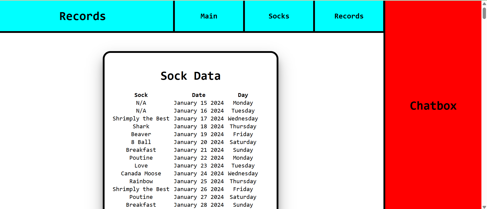

# Sock Website Work

[https://www.notion.so](https://www.notion.so)

[https://www.notion.so](https://www.notion.so)

April 27

Today’s work consisted of:

- Choosing font (MapleMono)
- Fixing Header
- Adding Chatbox header
- Adding border style
- Adding link boxes
- Making scroll pretty
- Adding hover effects to scroll and link boxes

May 3

Today’s work consisted of:

- Adding a search bar feature
- Searching for specific year functionality
- Searching for specific month functionality
- Searching for specific day (number or letter) functionality
- Searching for specific sock functionality. Was not originally planned but was the only category remaining
- Changed 8 Ball to Eight Ball to avoid issues discerning searching for ‘8’ as in Day or as in Sock
- Fixed bug where Main graphs stopped showing
- Fixed MapleMono font bug. 2nd photo is how the text should appear
- Altered font and scroll size to adjust for new font
- Added a freak detector. 3rd photo

May 4

Today’s work consisted of:

- Adding Socks page
- Adding list of all sock types
- Adding sorting functionality (sort by Name, Popular, or Recent)

May 7

Today’s work consisted of:

- Adding ability to customize specific sock boxes. Useful for adding unique photo and id. Could be used for secrets as well
- Added hover effect
- Changed div background colour for reference
- Stylized sorting option
- Added hover effect to record search. Unsure if it’s too much or if it should be kept

May 9

Today’s work consisted of:

- Changed record search to sliding modal
- Changed some text to bold

May 13

Today’s work consisted of:

- Fixed the sock data boxes
- Added “ Socks” to the end of their titles
- Added a scroll toggle

May 17

Today’s work consisted of:

- Added the photos for all but 7 socks
- Added an animation to them

May 18

Today’s work consisted of:

- Added the final 7 sock images
- Added a description column to the socktype table
- Added #worn, first seen, last seen, and description data entries

May 19

Today’s work consisted of:

- Reformatted the sock data boxes
- Tried to add most popular month + day but couldn’t get it to work

May 20

Today’s work consisted of:

- Added popular month + day
- Reformated stats
- Need to adjust sizing

May 26

Got inspired by [https://www.sharyap.com/](https://www.sharyap.com/)

Today’s work consisted of:

- Allowed for draggable sock stat divs
- Added a header and exit button to the modals
- Adjusted shadow style to be more cartoony

May 27 

Today’s work consisted of:

- Changing the way z-index works for the modal tabs
- Changed the animation for opening and closing the tabs

June 2

Today’s work consisted of:

- Added background pattern to record tab

June 9

Today’s work consisted of:

- Deleted the database :)
- Restored the database
- Added a faster method of restoring the database
- Added line chart

June 10

Today’s work consisted of:

- Fixed the database
- Fixed line chart
- Added ‘Newest’ sorting option

June 11

Today’s work consisted of:

- Changing pie chart from total to percentage

June 12

Today’s work consisted of:

- Added result total to records page

June 13

Today’s work consisted of:

- Fixed zero entity background error
- Added cap to results
- Altered time chart layout
- Added sock checklist
- Added alive check to socktype
- Display gravestone emoji on sock modal if sock is no longer with us
- Added select all button

Things to add:

- Dark mode

June 14

Today’s work consisted of:

- Added total sock count, total day count, top sock (100 days), and sotm (30 days)

Things to add:

Records:

- Fix shadows
- Fix background colour

Socks:

- Change to sidescroll
- Move filter
- Adjust sock button size

Main:

- Format page properly
- Add more to Top Sock / SOTM
- Adjust pie chart size

Other:

- Chatbox
- Colour theme
- Dark mode
- Sound effects

June 17

Today’s work consisted of:

- Fixed sock stat text overflow bug
- Changed sock page layout. Don’t like it but need it smaller to fit everything
- I’m warming up to it
- Added buttons for left and right movement
- Added numbers to sock boxes

June 18
Today’s work consisted of:

- Created new featured table
- Added method to get featured sock of the day
- Added method of creating a featured sock entry for each day (randomly chosen)
- Created tab to display the featured sock

July 19

Today’s work consisted of:

- Added button to go to top on record page
- I let Ava choose the colours pt 1

June 22

Today’s work consisted of:

- Created first iteration of Socko 1.0. Working a lot better than expected
- Need to tweak personality and find a way to safely implement him into the website
- Considering giving him more data

June 23

Today’s work consisted of:

- Changed Rainbow sock name to Rainbow Square socks in order to introduce Rainbow Striped socks
- Changed Sheet sock to Spreadsheet socks in order for ai to discern between google sheet and bedsheet.

June 28

Today’s work consisted of:

- Added new sock images
- Added flip effect to sock tab info sheet
- Allow for info to be stored on backside. Not sure what I want there yet

June 29

Today’s work consisted of:

- Added close button to chatbox. Need this for showing off part 1
- Added colour picker to backside of sock info sheet. Can change tab background. Unsure if I’m keeping it or if it’ll just be for testing
- Added contrast detection for text. Will be very useful for dark mode

July 1

Today’s work consisted of:

- Pulled sock colour data to auto display on the sock tabs
- Decreased tab size again to allow for more visible space

July 2

Today’s work consisted of:

- Added tab buttons to featured, top, and sotm

July 4

Today’s work consisted of:

- Fixed main page sock tabs to create unique sotm and top versions

July 10

Today’s work consisted of:

- Finished dummy dark mode button
- Used root colours to change from dark mode to light mode
- Added fade effect to each element when the colour changes
- Added sun and moon icons

July 11

Today’s work consisted of:

- Added fixed border and font colours to root
- Added dark mode to font
- Tweaked sockStat close button animation
- Tweaked sockBox open animation. Not sure if I like it
- Tweaked modeIcon swap animation. Love it
- Fixed tab style

July 12

Today’s work consisted of:

- Added socko 2.0. This was a lot of work but is essentially complete
- He’s already a piece of shit and I love him. Talks a bit too much

July 15

Today’s work consisted of:

- Changed sotm and top sock to not display first seen

July 18

Today’s work consisted of:

- Fixed top sock and sotm positioning bug

July 19

Things to add:

- Chat history for chatbot between pages
- Socko and patterns
- Paint app
- Finish website colours
- Sound effects
- Pins for sock tabs
- Mobile version

July 23

Today’s work consisted of:

- Reversed sock order when listing newest socks

July 25

Today’s work consisted of:

- Tested with stickers
- Decided against it due to excesive rules and memory spikes
- May bring back for drawing tool

August 10

Today’s work consisted of:

- Added pin icon to sock tab
- Added light and dark mode functionality to pin icon

August 16

Today’s work consisted of:

- Added auto scroll to Socko
- Changed the font style of the graphs
- Made the searchType button fixed
- Added border to main page container
- Gave all items a background-color transition
- Tweaked colours

August 18

Today’s work consisted of:

- Added scrolling background to main page

August 19

Today’s work consisted of:

- Fixed featured null bug
- Worked on memory leak issue

August 20

Today’s work consisted of:

- Worked on memory leak issue. Most are resolved, changing from +100MB per page loaded to +15MB. Last memory leak comes from the scrolling background. Further work needed to fix it
- Added memory to chatBox so it stays closed between pages
- Tweaked colours
- Fixed fixed to absolute drag bug
- Fixed absolute modal out of bounds bug

August 21

Today’s work consisted of:

- Added border highlights to dark mode header

August 22

Today’s work consisted of:

- Finished colours for main page

August 23

Today’s work consisted of:

- Worked on logo

August 24

Today’s work consisted of:

- Finalized logo
- Added logo to main page

September 14

Today’s work consisted of:

- Brought back the website to how it was on August 24 (excluding socko)
- Lost the website September 4
- Main page is back with proper colours
- Records and Socks just need colour and then will be complete

What needs to be done (besides boring stuff):

- Socko chatbot + icon
- Sock stat pin bug
- Record page colours
- Sock page colours

Once those are done, the website will be *complete

September 22

Today’s work consisted of:

- Deleted server.js again
- Remade server.js again

September 23

- Cleaned up background changing code
- Decided on colour palette. Making everything blue is a lot easier, not completely the theme I envisioned but still looks good

- Fixed sock modal bounds bug

What’s left:

- Tweak styling and clean up
- Clean up code
- Comment
- Add sound effects
- Deepseek AI
- Socko
- Fill in empty space when chatbox is closed
- Mobile version

September 25

Today’s work consisted of:

- Fixed pinned sock modal bounds bug
- Cleaned up root colours
- Cleaned up transitions
- Cleaned up background styling

September 29

Today’s work consisted of:

- Commented script.js
- Commented server.js
- Begun working on fixing chatbot

October 1

Today’s work consisted of:

- Brought Socko back
- Need to tweak the styling, add the loading svg back, and add the quality of life improvements from before but we’re getting close

October 2

Today’s work consisted of:

- Stylized chatbox
- Used too many prompts and got locked out for the day
- Added chat memory
- Fill in empty space when chatbox is closed
- Added Socko

What’s left:

- Add sound effects
- Mobile version
- Voting page?

October 4

Today’s work consisted of:

- Worked on mobile version
- Finished mobile header. Will have to fix again if I add another page
- Finished sock page. Had to remake the dragging again because of it :)

October 5

Today’s work consisted of:

- Continued to work on mobile version, focusing on main page

October 6

Today’s work consisted of:

- Continued to work on mobile version, focusing on main page

October 7

Today’s work consisted of:

- Finished mobile version of main page (I think)
- Decided to hide time graph (too complex to add to mobile)
- Added icon

October 8

Today’s work consisted of:

- Finished Records mobile page
- Found issue with chatbot positioning

October 10

Today’s work consisted of:

- Fixed chatbox mobile position  issue

October 11

Today’s work consisted of:

- Made new vote page (my work will never end)
- Created new votes database
- Created method to submit votes with a 24 hour limit

October 13

Today’s work consisted of:

- Added the coolest tech to the sock modals
- Now instead of being able to add as many socks to the page until it overloads, a limit of 5 is placed, with the modals being added to a queue and replaced in order
- Removes the ability to add a bunch of socks to the page but the ui is so clean and its performance friendly
- Moved vote page to socks since vote was too similar to socks
- Added chart to see total votes

October 14

Today’s work consisted of:

- Did more work with the voting mechanism
- Decided to scrap it. Doesn’t flow well with the rest of the website. Cool feature but something I can do another time
- Working on removing old code. Shouldn’t break anything but need to keep eye out

October 15

Today’s work consisted of:

- Fixed bug where pinned would stick between switching modals. Now pre-pinned only occurs if the modal was just closed, then opened, or if the modal was pinned and then replaced while still visible
- Fixed line chart update animation
- Added howler sound effects (don’t like them but the functionality works)
- Added volume button

October 17:

The project is done